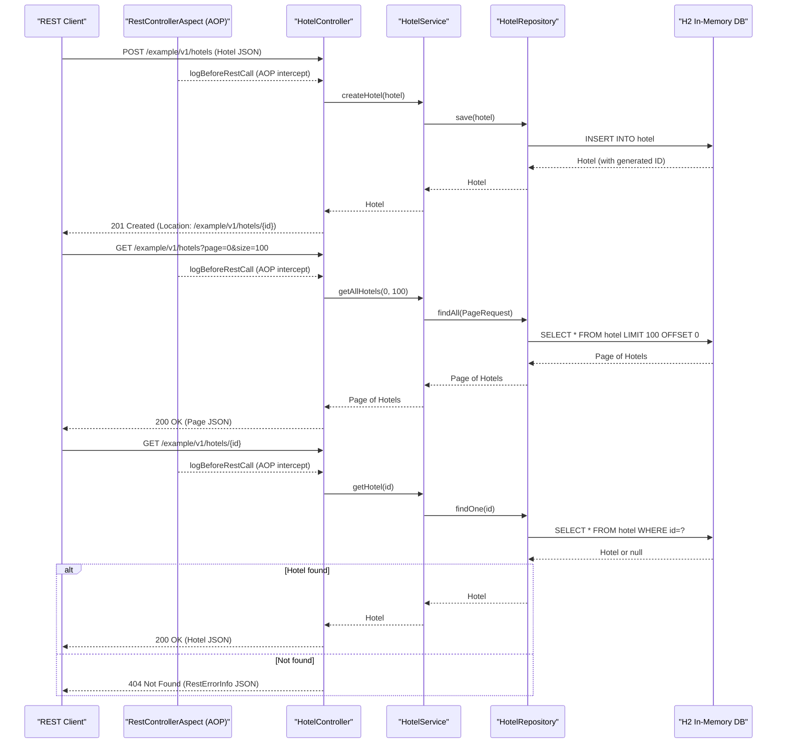

# API & Service Communication Contracts

This document covers the API surface of the Spring Boot REST Example application — a single-service REST API exposing 5 endpoints for Hotel resource management over HTTP on port 8090.

## Service Catalog

| Service | Port | Category | Purpose |
|---------|------|----------|---------|
| spring-boot-rest-example | 8090 | Business | Main REST API for CRUD operations on Hotel resources |
| Management / Actuator | 8091 | Observability | Spring Boot Actuator health, metrics, and info endpoints (separate port) |

## API Endpoints Inventory

| Service | Method | Path | Request Type | Response Type |
|---------|--------|------|-------------|--------------|
| HotelController | POST | /example/v1/hotels | Hotel (JSON or XML body) | 201 Created; Location header with new resource URL |
| HotelController | GET | /example/v1/hotels | page (query, default 0), size (query, default 100) | 200 Page of Hotel (JSON or XML) |
| HotelController | GET | /example/v1/hotels/{id} | id (path parameter, Long) | 200 Hotel (JSON or XML); 404 if not found |
| HotelController | PUT | /example/v1/hotels/{id} | id (path), Hotel (JSON or XML body) | 204 No Content; 400 if IDs mismatch; 404 if not found |
| HotelController | DELETE | /example/v1/hotels/{id} | id (path parameter, Long) | 204 No Content; 404 if not found |

API versioning is implemented via a URL path prefix (`/example/v1/`).

## Management & Observability Endpoints

| Service | Endpoint | Notes |
|---------|----------|-------|
| Actuator | /health | Custom `HotelServiceHealth` indicator adds service profile detail |
| Actuator | /info | Exposes build metadata from `pom.xml` (artifact, name, version) |
| Actuator | /metrics | Standard Boot Actuator metrics |
| Actuator | /metrics/Khoubyari.HotelService.getAll.largePayload | Custom counter incremented by `HotelService` when page size > 50 |
| Swagger UI | /swagger-ui.html | Interactive API documentation (Springfox Swagger 2) |
| Swagger JSON | /v2/api-docs | Machine-readable OpenAPI 2.0 specification |

The management port (8091) has security disabled and is intended for internal/ops use only.

## DTOs & Contracts

The application uses a single domain class as both the JPA entity and the API contract DTO:

- **Hotel**: Serves as the request body for POST and PUT, and as the response body for GET endpoints. It is a mutable POJO with no immutability guarantees (no Lombok `@Value`, no Java records). For full field definitions and ORM mapping, see `data-architecture.md`.
- **RestErrorInfo**: Returned as the response body for 400 (DataFormatException) and 404 (ResourceNotFoundException) error responses. Contains exception message and a human-readable hint.

There are no separate request/response DTO classes — the same `Hotel` object is used for input and output. There are no protobuf schemas, GraphQL schemas, or OpenAPI specification files on disk; the API spec is generated at runtime by Springfox from annotations.

Serialization supports both `application/json` and `application/xml` for Hotel resources, configured via `@RequestMapping` `consumes`/`produces` attributes and JAXB annotations (`@XmlRootElement`) on the Hotel entity.

## Communication Patterns

**Synchronous REST only**: The application is a single-service monolith. All client communication is synchronous HTTP/REST. There is no inter-service communication, message broker, or asynchronous event-driven pattern between services.

**Intra-service**: The controller delegates directly to the service layer (`HotelService`), which delegates to the repository (`HotelRepository`). An AOP aspect (`RestControllerAspect`) intercepts controller method calls for logging before execution.

**Application events**: `HotelServiceEvent` extends Spring's `ApplicationEvent` and is published via `AbstractRestHandler.eventPublisher`, but this is an internal Spring event bus — not an external message broker or async queue.

**Resilience patterns**: No circuit breaker, retry policy, timeout configuration, or bulkhead pattern is implemented. There are no Resilience4j, Spring Retry, or Hystrix dependencies.

**Service discovery**: None. The application runs as a standalone process with hardcoded port (`8090`). No Eureka, Consul, or Kubernetes-based discovery is configured.

**API gateway**: None. The application is directly exposed to clients with no API gateway layer.

**Security posture**: HTTP Basic authentication is **explicitly disabled** in `application.yml` (`security.basic.enabled: false`). The Spring Security dependency is on the classpath but authentication is turned off. The management port (8091) also has security disabled. There is no TLS/HTTPS configuration, no JWT, no OAuth2, and no authorization (`@PreAuthorize`, role checks). **All endpoints on port 8090 are publicly accessible with no authentication or authorization checks.**

## Service Technology Matrix

| Service | Web Framework | Data Access | Discovery | Gateway | Actuator | Cache | Metrics |
|---------|--------------|-------------|-----------|---------|----------|-------|---------|
| spring-boot-rest-example | Spring MVC (servlet) | Spring Data JPA / Hibernate | None | None | Yes (port 8091) | None | CounterService, GaugeService (Boot Actuator) |

## Service Communication Sequence

