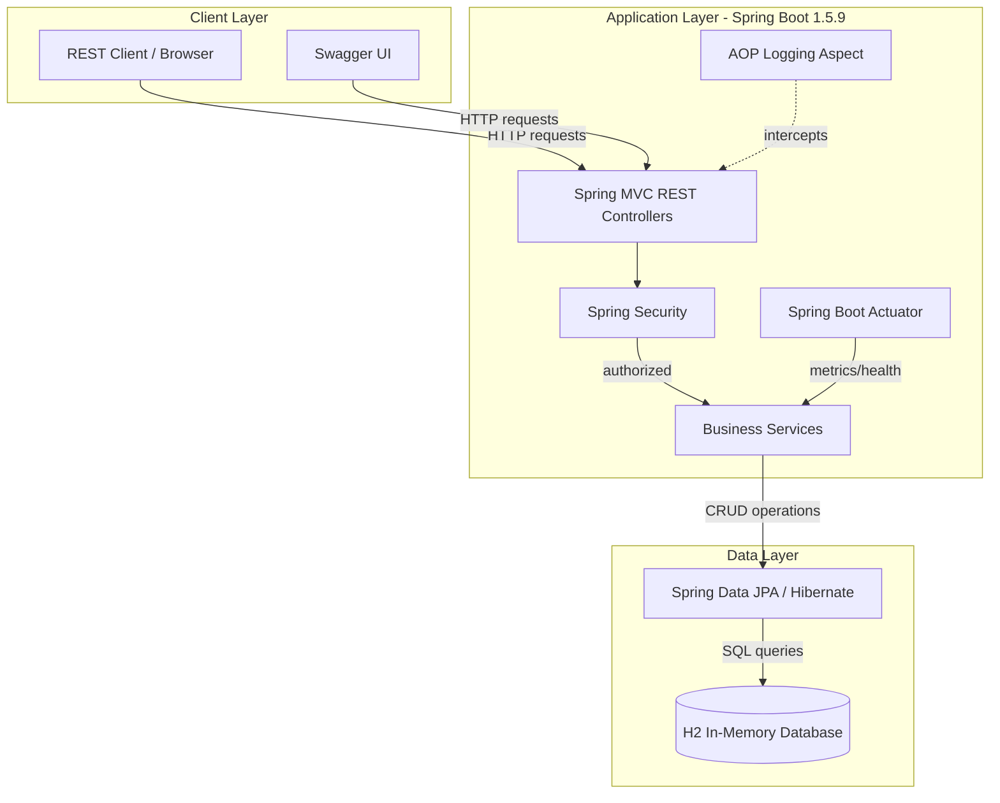
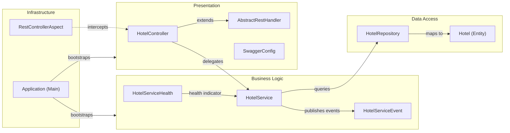

# Architecture Diagram

This document describes the architecture of the Spring Boot REST Example application — a simple RESTful hotel management API built with Spring Boot 1.5, Spring Data JPA, and an in-memory H2 database.

## Application Architecture

### Technology Stack Summary

| Layer | Technology | Version | Purpose |
|-------|-----------|---------|---------|
| Presentation | Spring MVC (REST) | 4.3.x (via Boot 1.5.9) | RESTful API endpoints |
| API Documentation | Springfox Swagger 2 | 2.5.0 | Interactive API documentation |
| Security | Spring Security | 4.2.x (via Boot 1.5.9) | HTTP Basic authentication |
| Business Logic | Spring Services | 4.3.x | Business logic and orchestration |
| Cross-cutting | Spring AOP | 4.3.x | Request logging aspect |
| Data Access | Spring Data JPA / Hibernate | via Boot 1.5.9 | ORM and repository abstraction |
| Database | H2 (in-memory) | 1.4.193 | Embedded relational database |
| Runtime | Spring Boot / Embedded Tomcat | 1.5.9 | Application server |
| Metrics | Spring Boot Actuator | 1.5.9 | Health checks and metrics |

### Data Storage & External Services

The application uses a single in-memory H2 relational database for all persistence. Data is stored in a `hotel` table managed via Hibernate/JPA. No external services, caches, or message brokers are used. All data is ephemeral — it resets on application restart. Spring Boot Actuator exposes health and metrics endpoints but does not integrate with any external monitoring system.

### Key Architectural Decisions

- **Embedded in-memory database**: H2 is used as the sole data store, making the application fully self-contained with zero external infrastructure dependencies.
- **Repository pattern via Spring Data JPA**: `HotelRepository` extends `PagingAndSortingRepository`, providing CRUD and pagination out of the box with no boilerplate SQL.
- **AOP-based request logging**: A `RestControllerAspect` intercepts all public controller methods before execution to log incoming REST calls, separating cross-cutting concerns from business logic.

## Component Relationships

### Component Inventory

| Component | Layer | Type | Responsibility |
|-----------|-------|------|---------------|
| HotelController | Presentation | REST Controller | Handles HTTP CRUD operations for Hotel resources (POST, GET, PUT, DELETE) |
| AbstractRestHandler | Presentation | Abstract Base | Provides common exception handling and event publishing for REST controllers |
| SwaggerConfig | Presentation | Configuration | Configures Springfox Swagger 2 API documentation |
| HotelService | Business Logic | Spring Service | Orchestrates hotel CRUD operations; records Actuator metrics |
| HotelServiceHealth | Business Logic | Health Indicator | Exposes custom health check for the hotel service via Actuator |
| HotelServiceEvent | Business Logic | Event Listener | Handles application events related to the hotel service |
| RestControllerAspect | Infrastructure | AOP Aspect | Logs all public REST controller method invocations before execution |
| HotelRepository | Data Access | JPA Repository | Provides CRUD and paginated access to Hotel entities via Spring Data |
| Hotel | Data Access | JPA Entity / DTO | Represents the Hotel domain object persisted to the H2 database |
| RestErrorInfo | Domain | DTO | Carries structured error information returned in error responses |
| Application | Infrastructure | Spring Boot Main | Application entry point; bootstraps the Spring Boot context |
