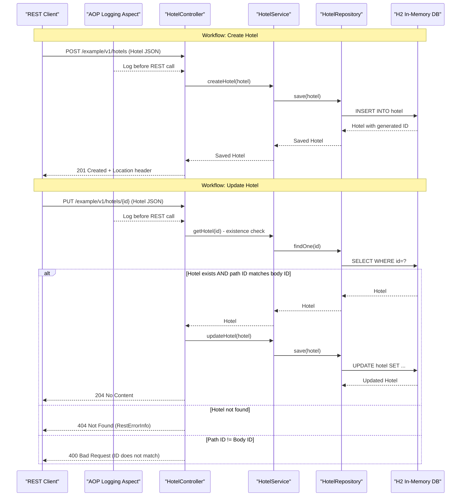

# Core Business Workflows

The application provides a hotel directory management service, allowing clients to create, retrieve, update, and delete Hotel records through a REST API.

## Domain Entities

| Entity | Service / Bounded Context | Description | Key Relationships |
|--------|--------------------------|-------------|------------------|
| Hotel | Hotel Management (sole service) | Represents a hotel with name, description, city, and a numeric quality rating | No relationships — standalone aggregate root |

The `Hotel` entity is the sole aggregate root and domain object. For entity field definitions and ORM mapping details, see `data-architecture.md`.

## Service-to-Domain Mapping

| Service | Domain Context | Owned Entities | External Dependencies |
|---------|---------------|---------------|----------------------|
| spring-boot-rest-example | Hotel Management | Hotel | None |

The application is a single-service monolith with no external service dependencies. All domain logic is co-located in one deployable unit.

## Primary Workflows

### Workflow 1: Create a Hotel

A client submits a new hotel record. The controller receives the request body, delegates to the service layer, which persists the entity and returns the generated identifier. The response includes a `Location` header pointing to the new resource URL.

Steps:
1. Client sends `POST /example/v1/hotels` with Hotel JSON or XML payload.
2. AOP aspect logs the incoming controller invocation.
3. `HotelController` delegates to `HotelService.createHotel(hotel)`.
4. `HotelService` calls `HotelRepository.save(hotel)` — Hibernate assigns a generated ID.
5. Controller constructs the `Location` header from the request URL and new ID.
6. Response: `201 Created` with `Location` header.

### Workflow 2: Retrieve a Paginated Hotel List

A client requests a page of hotels. The service uses Spring Data pagination to limit result size, and records a counter metric if the requested page size exceeds 50.

Steps:
1. Client sends `GET /example/v1/hotels?page=0&size=100`.
2. AOP aspect logs the controller invocation.
3. `HotelController` delegates to `HotelService.getAllHotels(page, size)`.
4. If `size > 50`, `HotelService` increments the `Khoubyari.HotelService.getAll.largePayload` Actuator counter.
5. `HotelService` calls `HotelRepository.findAll(PageRequest)`.
6. Response: `200 OK` with a paginated `Page<Hotel>` JSON body.

### Workflow 3: Retrieve a Single Hotel

A client retrieves a specific hotel by ID. If the hotel does not exist, a `ResourceNotFoundException` is raised, which is mapped to a `404 Not Found` response.

Steps:
1. Client sends `GET /example/v1/hotels/{id}`.
2. AOP aspect logs the controller invocation.
3. `HotelController` calls `HotelService.getHotel(id)`.
4. `HotelRepository.findOne(id)` returns the Hotel or `null`.
5. `AbstractRestHandler.checkResourceFound(hotel)` throws `ResourceNotFoundException` if result is `null`.
6. Response: `200 OK` with Hotel body, or `404 Not Found` with `RestErrorInfo` body.

### Workflow 4: Update a Hotel

A client updates an existing hotel. The controller enforces that the path ID matches the body ID before delegating the save operation.

Steps:
1. Client sends `PUT /example/v1/hotels/{id}` with updated Hotel JSON or XML.
2. AOP aspect logs the controller invocation.
3. `HotelController` verifies the hotel exists via `HotelService.getHotel(id)` — throws `ResourceNotFoundException` if not found.
4. Controller checks that the path `{id}` equals `hotel.getId()` — throws `DataFormatException("ID doesn't match!")` if they differ.
5. `HotelService.updateHotel(hotel)` calls `HotelRepository.save(hotel)`.
6. Response: `204 No Content`.

### Workflow 5: Delete a Hotel

A client deletes a hotel by ID. Existence is verified before deletion.

Steps:
1. Client sends `DELETE /example/v1/hotels/{id}`.
2. AOP aspect logs the controller invocation.
3. `HotelController` verifies the hotel exists via `HotelService.getHotel(id)` — throws `ResourceNotFoundException` if not found.
4. `HotelService.deleteHotel(id)` calls `HotelRepository.delete(id)`.
5. Response: `204 No Content`.

## Cross-Service Data Flows

The application is a single-service monolith with no inter-service communication. There are no API gateway aggregation patterns, cross-service data joins, or circuit breaker fallback flows. All data access is local — the controller calls the service, which calls the repository, which queries the embedded H2 database.

An `HotelServiceEvent` (Spring `ApplicationEvent`) can be published via the `AbstractRestHandler.eventPublisher`, but this is an internal Spring application event bus with no external consumers configured — it does not represent a cross-service data flow.

## Business Workflow Sequence

## Business Rules & Decision Logic

**Validation Rules:**
- Hotel creation and update require a non-null `name` field (enforced by `@Column(nullable = false)` at the database level — no explicit application-layer validator is present).
- On PUT, the path parameter `{id}` must equal `hotel.getId()` in the request body. Mismatch throws `DataFormatException("ID doesn't match!")`, returning `400 Bad Request`.

**Decision Logic:**
- Any operation on a specific hotel ID first checks existence. A `null` result from the repository triggers a `ResourceNotFoundException`, mapped to `404 Not Found`.
- In `getAllHotels`, if the requested page `size` exceeds 50, the Actuator counter `Khoubyari.HotelService.getAll.largePayload` is incremented as an observability signal for large-payload requests.

**State Transitions:**
- `Hotel` has no lifecycle states beyond existence. There are no status fields, approval workflows, or state machine transitions.

**Error Handling:**
- `DataFormatException` → `400 Bad Request` with `RestErrorInfo` body (handler in `AbstractRestHandler`).
- `ResourceNotFoundException` → `404 Not Found` with `RestErrorInfo` body (handler in `AbstractRestHandler`).
- No compensating transactions or saga patterns are present.

**Audit/Logging:**
- All public REST controller method invocations are logged before execution via `RestControllerAspect` (`@Before` AOP advice), providing a request-level audit trail in the application log.

**Authorization:**
- HTTP Basic authentication is explicitly disabled (`security.basic.enabled: false`). All endpoints are publicly accessible with no authentication or authorization checks. No role-based or resource-ownership rules are implemented.
