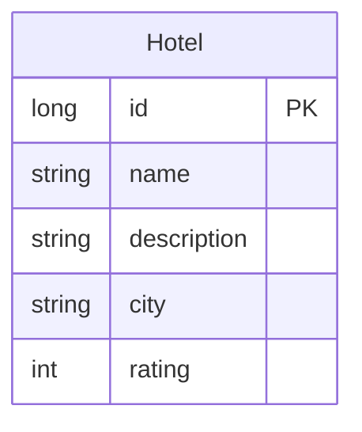

# Data Architecture & Persistence Layer

The application uses a single in-memory H2 relational database with one JPA entity (`Hotel`) managed by Hibernate, accessed via Spring Data JPA repositories.

## Database Configuration

| Service/Module | DB Type | Profile | Driver | Connection | Migration Tool |
|---------------|---------|---------|--------|-----------|---------------|
| spring-boot-rest-example | H2 (in-memory) | default / all | org.h2.Driver | jdbc:h2:mem:bootexample;MODE=MySQL | None |
| spring-boot-rest-example | H2 (in-memory) | test | org.h2.Driver | jdbc:h2:mem:bootexample;MODE=MySQL | None |

Schema management: Hibernate DDL auto is set to `create-drop` in the test profile (schema is created at startup and dropped at shutdown). The H2 console is enabled in the test profile for interactive inspection. No Flyway, Liquibase, or SQL migration scripts are used — the schema is fully owned by Hibernate's DDL generation. No seed data files (`data.sql`, `import.sql`) were found. For full property key-value listings, see `configuration-inventory.md`.

## Data Ownership per Service

| Service | Tables Owned | ORM Framework | Caching | Notes |
|---------|-------------|--------------|---------|-------|
| spring-boot-rest-example | hotel | Hibernate 5 (via Spring Data JPA) | None | Single-module monolith; no shared data stores or cross-service boundaries |

## Entity Model

The `Hotel` entity is the sole persistent domain object. It maps to a single `hotel` table. No entity relationships (associations, joins, or foreign keys) exist. The entity doubles as the API DTO — there is no separate request/response model. Source file: `src/main/java/com/khoubyari/example/domain/Hotel.java`.

## Key Repository Methods

| Service | Repository | Notable Methods | Purpose |
|---------|-----------|----------------|---------|
| spring-boot-rest-example | HotelRepository (extends PagingAndSortingRepository) | `findHotelByCity(String city)` | Finds a single Hotel by city name (derived query) |
| spring-boot-rest-example | HotelRepository | `findAll(Pageable pageable)` | Returns a paginated Page of Hotel records |
| spring-boot-rest-example | HotelRepository | `save(Hotel)`, `findOne(Long)`, `delete(Long)` | Standard CRUD inherited from PagingAndSortingRepository |

No `@Query` annotations, named queries, stored procedure calls, or batch/bulk query methods are present. Transaction management uses Spring Data JPA defaults — repository methods are implicitly transactional.

## Caching Strategy

No caching layer is configured. There is no Redis, EhCache, Caffeine, or Spring `@Cacheable`/`@CacheEvict` usage anywhere in the codebase. Hibernate second-level cache is not enabled. All reads hit the H2 in-memory database directly for every request.

Spring Boot Actuator `CounterService` and `GaugeService` are used in `HotelService` for lightweight metrics recording (incrementing a counter when `getAllHotels` is called with page size > 50), but these are not a caching mechanism.

## Data Ownership Boundaries

The application is a single-module monolith with one logical data store. There are no cross-service data access patterns, shared databases, or bounded context boundaries — the `hotel` table is exclusively owned and accessed by a single service and a single repository. There is no CQRS, event sourcing, or read/write model separation. All data access is synchronous and co-located.

### Data Classification & Sensitivity

| Entity | Sensitive Fields | Classification | Controls in Place |
|--------|----------------|---------------|-------------------|
| Hotel | name, description, city, rating | None (public business data) | N/A |

No PII, PHI, or PCI data is detected in the entity model. The `Hotel` entity stores only public business information (hotel name, description, city, and rating). No encryption-at-rest, data masking, or field-level access controls are needed or configured.
