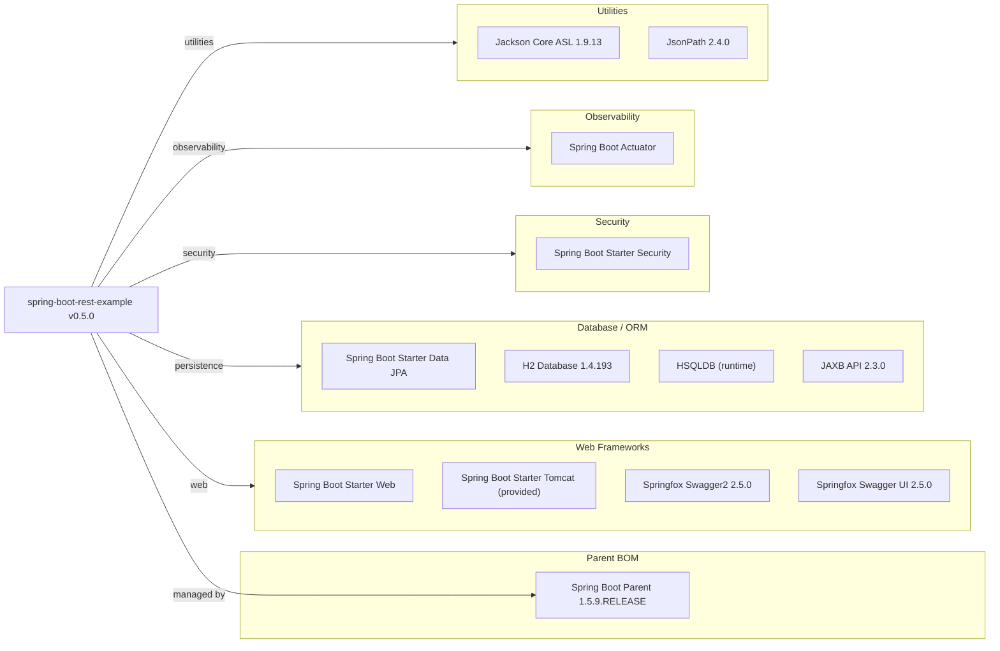

# Dependency Map

This document maps all external dependencies declared in the Spring Boot REST Example project (`pom.xml`). The project declares 14 non-test dependencies across 5 functional categories, managed via the Spring Boot 1.5.9 parent BOM.

## Dependencies

### Dependency Summary

| Category | Count | Key Libraries | Notes |
|----------|-------|--------------|-------|
| Web Frameworks | 4 | Spring Boot Starter Web, Springfox Swagger2 2.5.0, Springfox Swagger UI 2.5.0 | Versions managed by Spring Boot 1.5.9 BOM; Springfox 2.5.0 is severely outdated |
| Database / ORM | 4 | Spring Data JPA / Hibernate, H2 1.4.193, HSQLDB (runtime), JAXB API 2.3.0 | Two in-memory databases declared; H2 used actively, HSQLDB appears redundant |
| Security | 1 | Spring Boot Starter Security | Configured via Boot 1.5.9; defaults to HTTP Basic auth |
| Observability | 1 | Spring Boot Actuator | Provides health, metrics endpoints; CounterService/GaugeService APIs deprecated in newer Boot |
| Utilities | 2 | Jackson Core ASL 1.9.13, JsonPath 2.4.0 | Jackson Core ASL 1.x is a legacy pre-2.x artifact; Jackson 2.x is included via Boot BOM |

### Version & Compatibility Risks

The most critical risk is the **Spring Boot parent version 1.5.9.RELEASE**, which has been end-of-life since August 2019. This pulls in Spring Framework 4.3.x, Spring Security 4.2.x, and Hibernate 5.0.x — all versions that are no longer receiving security patches. **H2 1.4.193** is also severely outdated (current stable is 2.x) and has known CVEs. **Springfox Swagger2 2.5.0** (released 2016) is incompatible with Spring Boot 2.6+ and is not actively maintained; migration to SpringDoc OpenAPI is recommended. **Jackson Core ASL 1.9.13** is a Jackson 1.x legacy artifact that is incompatible with the Jackson 2.x included by the Spring Boot BOM — this creates a potential classpath conflict. **JAXB API 2.3.0** is needed because Java 8's JAXB was removed in Java 11+, but the declared version conflicts with later JDK compatibility.

### Notable Observations

- **Duplicate in-memory databases**: Both H2 (`1.4.193`) and HSQLDB are declared as database dependencies. Only H2 appears to be actively used; HSQLDB is redundant and should be removed.
- **Legacy Jackson 1.x artifact**: `jackson-core-asl 1.9.13` is a Jackson 1.x module that predates the current `com.fasterxml.jackson` groupId. Spring Boot 1.5.9 already brings in Jackson 2.x via its BOM, making this declaration unnecessary and potentially conflicting.
- **Spring Boot Actuator uses deprecated metric APIs**: `HotelService` directly injects `CounterService` and `GaugeService`, which were deprecated in Spring Boot 1.5 and removed in Spring Boot 2.0, making a future upgrade more invasive.
- **Springfox 2.5.0 is a 2016-era artifact**: The Swagger integration library is over 8 years old and incompatible with Spring Boot 2.6+. Migration to SpringDoc OpenAPI 2.x is required for any Boot 2.6+ upgrade.

## Test Dependencies

| Framework | Version | Notes |
|-----------|---------|-------|
| Spring Boot Starter Test | Managed by Boot 1.5.9 BOM | Pulls in JUnit 4, Mockito 1.x, Spring Test, Hamcrest |
| JsonPath Assert | 0.9.1 | Legacy JsonPath assertion library; current versions are 2.x |

Total test-scope dependencies: 2 declared (each pulls in transitive test libraries via the Spring Boot BOM)

The test infrastructure is built entirely on JUnit 4 and Mockito 1.x via the Spring Boot Starter Test aggregate. There is no integration test framework (e.g., Testcontainers) or contract testing library. The `json-path-assert` version (0.9.1) is significantly outdated compared to the runtime `json-path 2.4.0`.
