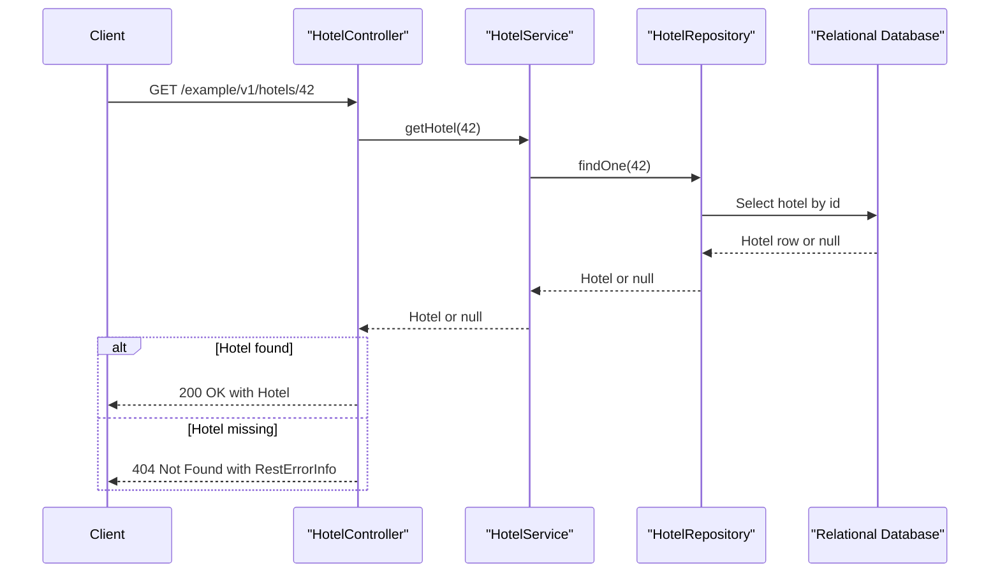

# API & Service Communication Contracts

The application exposes a small synchronous REST surface for managing hotels plus a separate set of actuator endpoints for operations. Communication stays inside a single deployable service, so the contracts are controller-to-service-to-repository flows rather than inter-service APIs.

## Service Catalog

| Service | Port | Category | Purpose |
|---|---:|---|---|
| spring-boot-rest-example | 8090 | API Layer | Exposes hotel CRUD endpoints and Swagger UI for the sample hotel catalog |
| spring-boot-rest-example management interface | 8091 | Observability | Exposes actuator health, metrics, environment, and mapping endpoints |

## API Endpoints Inventory

| Service | Method | Path | Request Type | Response Type |
|---|---|---|---|---|
| spring-boot-rest-example | POST | `/example/v1/hotels` | Request body: `Hotel` | `201 Created`, `Location` header |
| spring-boot-rest-example | GET | `/example/v1/hotels` | Query params: `page`, `size` | `200 OK`, `Page<Hotel>` |
| spring-boot-rest-example | GET | `/example/v1/hotels/{id}` | Path param: `id` | `200 OK`, `Hotel`; `404`, `RestErrorInfo` |
| spring-boot-rest-example | PUT | `/example/v1/hotels/{id}` | Path param: `id`, request body: `Hotel` | `204 No Content`; `400`, `RestErrorInfo`; `404`, `RestErrorInfo` |
| spring-boot-rest-example | DELETE | `/example/v1/hotels/{id}` | Path param: `id` | `204 No Content`; `404`, `RestErrorInfo` |

## Management & Observability Endpoints

| Service | Endpoint | Custom Metrics (if any) |
|---|---|---|
| spring-boot-rest-example management interface | `/health` | Includes custom `HotelServiceHealth` details using `hotel.service.name` |
| spring-boot-rest-example management interface | `/metrics` | Exposes `Khoubyari.HotelService.getAll.largePayload` when page size exceeds 50 |
| spring-boot-rest-example management interface | `/info`, `/env`, `/configprops`, `/mappings`, `/beans`, `/trace` | No additional custom metrics detected |
| spring-boot-rest-example | `/swagger-ui.html` | Swagger UI generated from controller annotations |

## DTOs & Contracts

The API uses `Hotel` as a mutable service-level entity that also serves as the request and response body for create, update, list, and retrieve operations. `RestErrorInfo` is the error response contract for `400 Bad Request` and `404 Not Found` paths, while pagination responses wrap `Hotel` instances in Spring Data's `Page<Hotel>` type.

Swagger 2 annotations on `HotelController` define the public contract and Springfox publishes the generated documentation. Serialization is handled by Spring MVC message converters with both JSON and XML representations enabled through the controller annotations and JAXB annotations on `Hotel`.

## Communication Patterns

All runtime communication is synchronous. External clients call Spring MVC endpoints, the controller delegates to `HotelService`, and the service uses `HotelRepository` for JPA-backed persistence against the configured relational database. No asynchronous messaging, service discovery, API gateway, gRPC, or cross-service composition is present.

No retry, timeout, circuit-breaker, or bulkhead library is configured in the codebase. Startup dependencies are minimal: the application starts with its embedded H2 database by default, or requires a reachable MySQL instance if the documented `mysql` profile is used.

At the API contract level, no authentication, authorization, or TLS requirements are configured in the application itself. Although `spring-boot-starter-security` is declared, `security.basic.enabled` is set to `false`, so all endpoints are effectively publicly accessible unless an external deployment layer adds protection.

## Service Technology Matrix

| Service | Web | Data Access | Discovery | Gateway | Actuator | Cache | Metrics |
|---|---|---|---|---|---|---|---|
| spring-boot-rest-example | Spring MVC | Spring Data JPA and Hibernate | none | none | yes | none | Actuator plus `CounterService` |

## Service Communication Sequence

