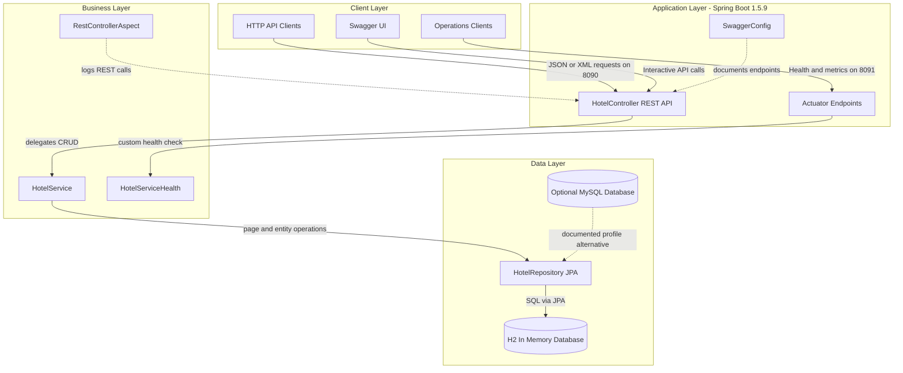
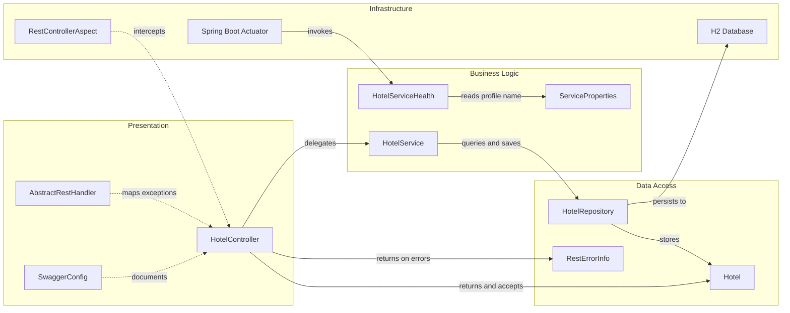

# Architecture Diagram

This repository contains a single Spring Boot service that exposes a hotel catalog REST API, operational endpoints, and Swagger documentation. The code follows a simple layered structure with one controller, one service, one repository, and one JPA entity.

## Application Architecture

### Technology Stack Summary

| Layer | Technology | Version | Purpose |
|---|---|---:|---|
| Client | HTTP clients and Swagger UI | N/A | Consume and explore the REST API |
| Presentation | Spring MVC REST controllers | Spring Boot 1.5.9.RELEASE | Expose hotel CRUD endpoints on port 8090 |
| Operations | Spring Boot Actuator | Spring Boot 1.5.9.RELEASE | Expose health, metrics, env, and info on port 8091 |
| Business | Spring service beans and AOP | Spring Framework via Boot 1.5.9.RELEASE | Coordinate CRUD logic, health details, and request logging |
| Data Access | Spring Data JPA and Hibernate | Spring Boot 1.5.9.RELEASE | Persist and page hotel data |
| Data Storage | H2 in-memory database | 1.4.193 | Default runtime data store |
| Alternate Storage | MySQL profile documented in README | N/A | Optional persistent relational database |
| API Documentation | Springfox Swagger | 2.5.0 | Generate Swagger 2 API docs |

### Data Storage & External Services

The application persists hotel records in an in-memory H2 database by default and documents an optional MySQL profile for a persistent relational backend. There are no outbound third-party APIs or message brokers; the only external-facing integrations are Swagger UI for documentation and Spring Boot Actuator for operational visibility.

### Key Architectural Decisions

- Uses a straightforward layered monolith with controller-to-service-to-repository delegation rather than multiple deployable services.
- Reuses the `Hotel` JPA entity as both the persistence model and the REST request/response contract.
- Separates operational traffic from business API traffic by serving actuator endpoints on port 8091 while keeping CRUD APIs on port 8090.

## Component Relationships

### Component Inventory

| Component | Layer | Type | Responsibility |
|---|---|---|---|
| HotelController | Presentation | REST Controller | Handles hotel CRUD requests and content negotiation |
| AbstractRestHandler | Presentation | Base Controller | Provides common paging defaults and exception mapping |
| SwaggerConfig | Presentation | Configuration | Publishes Swagger 2 documentation for the REST API |
| HotelService | Business Logic | Service | Performs CRUD delegation and emits a large-payload metric |
| HotelServiceHealth | Business Logic | HealthIndicator | Adds application-specific health details to actuator output |
| ServiceProperties | Business Logic | Configuration Properties | Binds the `hotel.service.name` profile-specific setting |
| HotelRepository | Data Access | Spring Data Repository | Executes hotel persistence and paging operations |
| Hotel | Data Access | JPA Entity and DTO | Represents the hotel record exchanged by the API |
| RestErrorInfo | Data Access | Error DTO | Shapes 400 and 404 error responses |
| RestControllerAspect | Infrastructure | Aspect | Logs REST controller invocations before execution |
| Spring Boot Actuator | Infrastructure | Management Framework | Exposes health, metrics, and configuration endpoints |
| H2 Database | Infrastructure | Embedded Database | Stores hotel records in memory by default |
