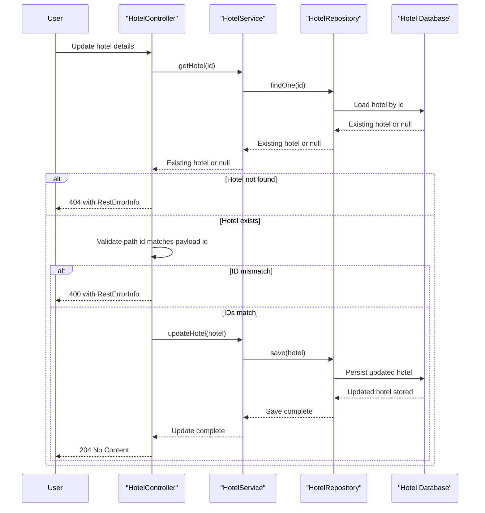

# Core Business Workflows

This application supports a single business domain: maintaining a catalog of hotel records that can be created, listed, updated, and removed through REST endpoints. The workflow logic is simple, but it still includes validation, error mapping, operational metrics, and profile-aware health reporting.

## Domain Entities

| Entity | Service / Bounded Context | Description | Key Relationships |
|---|---|---|---|
| Hotel | Hotel Catalog | Core business record representing a hotel entry exposed by the API | Persisted by the hotel catalog service; no child or parent aggregates |
| RestErrorInfo | API Error Handling | Error payload returned when requests fail validation or target a missing hotel | Emitted by controller exception handling for `400` and `404` outcomes |

## Service-to-Domain Mapping

| Service | Domain Context | Owned Entities | External Dependencies |
|---|---|---|---|
| spring-boot-rest-example | Hotel Catalog Management | `Hotel`, `RestErrorInfo` contract | H2 by default, optional MySQL profile, Spring Boot Actuator, Swagger UI |

## Primary Workflows

### Workflow 1: Create a hotel entry

A client submits `POST /example/v1/hotels` with a `Hotel` payload. The controller forwards the request to `HotelService`, the service persists it through `HotelRepository`, and the API returns `201 Created` with the new resource URL in the `Location` header.

### Workflow 2: Retrieve paginated hotel listings

A client submits `GET /example/v1/hotels?page={page}&size={size}` to browse the catalog. The controller requests a page from `HotelService`, the service delegates paging to `HotelRepository`, and a custom metric is incremented when the requested page size exceeds 50 to highlight unusually large payloads.

### Workflow 3: Update or delete an existing hotel

For updates, the client submits `PUT /example/v1/hotels/{id}` and the controller first checks that the hotel exists and that the path ID matches the payload ID before saving changes. For deletes, the controller verifies existence and then removes the record; missing resources are surfaced as `404 Not Found` through the shared exception-handling flow.

## Cross-Service Data Flows

There are no cross-service or cross-module data composition flows in this repository. The only runtime flow is internal to the single application: client request to controller, controller to service, service to repository, and repository to the configured relational database, with actuator endpoints observing the same service state rather than orchestrating separate services.

## Business Workflow Sequence

## Business Rules & Decision Logic

- `Hotel.name` is mandatory because the entity maps it to a non-null database column.
- Update requests must keep the path ID and payload ID aligned; otherwise `DataFormatException` produces a `400 Bad Request` response.
- Retrieve, update, and delete operations require the target hotel to exist; missing records trigger `ResourceNotFoundException` and a `404 Not Found` response.
- Collection reads default to page `0` and size `100`, establishing the standard browsing behavior for the catalog.
- Requests for more than 50 hotels increment the `Khoubyari.HotelService.getAll.largePayload` metric, making oversized reads visible operationally.
- Cross-cutting behavior includes controller call logging via `RestControllerAspect`, exception-to-response translation in `AbstractRestHandler`, and actuator health enrichment through `HotelServiceHealth` plus `ServiceProperties`.
