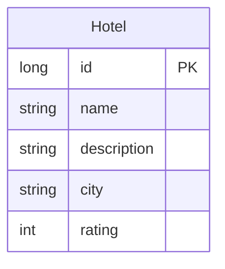

# Data Architecture & Persistence Layer

The data layer is intentionally small: one JPA-managed entity stored in an embedded relational database by default, with an optional MySQL profile documented for persistence outside memory. Spring Data JPA and Hibernate provide the full persistence abstraction for this single-service application.

## Database Configuration

| Service/Module | DB Type | Profile | Driver | Connection | Migration Tool |
|---|---|---|---|---|---|
| spring-boot-rest-example | H2 in-memory | default | `org.h2.Driver` | `jdbc:h2:mem:bootexample;MODE=MySQL` | none |
| spring-boot-rest-example | H2 in-memory | test | `org.h2.Driver` | `jdbc:h2:mem:bootexample;MODE=MySQL` | none; Hibernate uses `create-drop` |
| spring-boot-rest-example | MySQL | mysql documented in README | `com.mysql.jdbc.Driver` | `jdbc:mysql://<your_mysql_host_or_ip>/bootexample` | none; README documents Hibernate `update` |

## Data Ownership per Service

| Service | Tables Owned | ORM Framework | Caching | Notes |
|---|---|---|---|---|
| spring-boot-rest-example | `hotel` | Spring Data JPA with Hibernate | none | Single service owns all persisted data; no shared schema with other services |

## Entity Model

The persistence model contains a single entity and no mapped relationships, join tables, or secondary aggregates.

## Key Repository Methods

| Service | Repository | Notable Methods | Purpose |
|---|---|---|---|
| spring-boot-rest-example | `HotelRepository` | `findHotelByCity(String city)` | Looks up one hotel by city using Spring Data query derivation |
| spring-boot-rest-example | `HotelRepository` | `findAll(Pageable pageable)` | Returns a paginated hotel list for the REST collection endpoint |
| spring-boot-rest-example | `HotelRepository` | inherited `save`, `findOne`, `delete` | Supports create, retrieve, update, and delete operations |

## Caching Strategy

No application caching layer is configured. The codebase does not use Spring Cache annotations, JCache, Hibernate second-level cache, or an external cache provider; the only runtime counters are actuator metrics emitted through `CounterService` when large pages are requested.

## Data Ownership Boundaries

The application is a single deployable service with one logical datastore, so there are no cross-service ownership boundaries, CQRS splits, or direct database reads across service boundaries. All reads and writes flow through `HotelRepository`, and the optional MySQL profile preserves the same ownership model while swapping the backing database.

### Data Classification & Sensitivity

| Entity | Sensitive Fields | Classification | Controls in Place |
|---|---|---|---|
| Hotel | none identified | None | No encryption, masking, or field-level controls are required by the current data model |

No PII, PHI, or PCI data was detected in the entity model.
