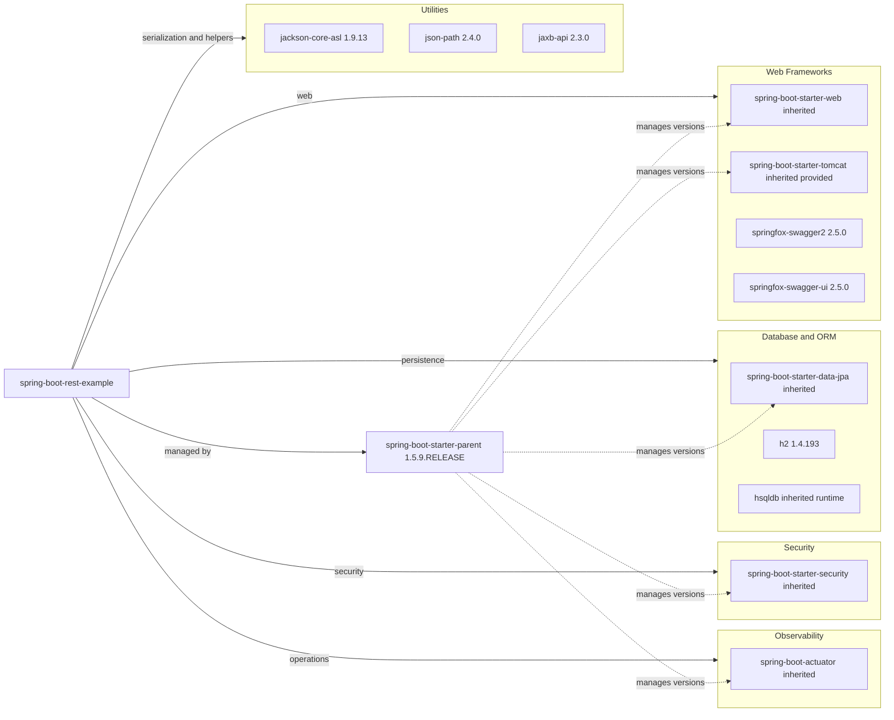

# Dependency Map

This Maven project declares 10 non-test dependencies plus 2 test-scoped dependencies. Its dependency set centers on an older Spring Boot 1.5 stack with JPA, embedded servlet support, Swagger 2, and embedded relational database options.

## Dependencies

### Dependency Summary

| Category | Count | Key Libraries | Notes |
|---|---:|---|---|
| Web Frameworks | 4 | spring-boot-starter-web, spring-boot-starter-tomcat, springfox-swagger2, springfox-swagger-ui | WAR packaging keeps Tomcat in `provided` scope while Springfox supplies Swagger 2 UI |
| Database and ORM | 3 | spring-boot-starter-data-jpa, h2, hsqldb | JPA and Hibernate back the API; H2 is the default DB and HSQLDB is an alternate runtime dependency |
| Security | 1 | spring-boot-starter-security | Security libraries are present even though basic auth is disabled in config |
| Observability | 1 | spring-boot-actuator | Exposes health, metrics, env, info, and mappings endpoints |
| Utilities | 3 | jackson-core-asl, json-path, jaxb-api | Support JSON processing, JSON path traversal, and XML binding |

### Version & Compatibility Risks

The parent stack is anchored to Spring Boot `1.5.9.RELEASE`, which is long end-of-life and tightly coupled to Java 8-era libraries. `jackson-core-asl` `1.9.13` is part of the deprecated Jackson 1 line, Springfox `2.5.0` is also dated, and H2 `1.4.193` predates the current major line, so both modernization and compatibility work should assume significant dependency upgrades.

### Notable Observations

- The project relies on a parent POM to manage most Spring dependency versions rather than pinning them locally.
- Both H2 and HSQLDB are present, but the runtime configuration only points to H2 by default.
- Swagger documentation is implemented through Springfox rather than OpenAPI 3 tooling.
- Security support is declared in Maven, but the application configuration disables basic authentication by default.

## Test Dependencies

| Framework | Version | Notes |
|---|---:|---|
| spring-boot-starter-test | 1.5.9.RELEASE | Provides the main test stack for Spring Boot integration tests |
| json-path-assert | 0.9.1 | Supports JSON response assertions in controller tests |

Total test-scope dependencies: 2

The test stack is small and centered on Spring Boot integration testing. It is also dated, which matches the rest of the Spring Boot 1.5 codebase and contributes to the current incompatibility with newer JDKs.
